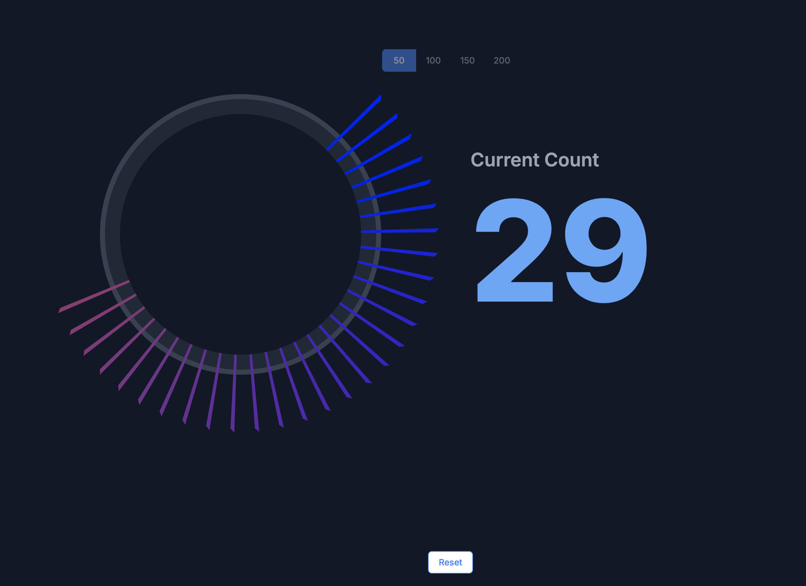

# MinnaBooster (みんなブースター)

欽ちゃんの仮装大賞のメーターをモチーフにした、リアルタイム参加型アプリケーション。
イベント参加者が一体となって楽しめるシンプルなWebアプリケーションです。

## 概要

メインスクリーンに表示されるメーターに対し、参加者は手元のスマートフォンからボタンを操作します。全員の操作がリアルタイムで集計され、目標値に到達するとお祝いのアニメーションが表示されます。
メーターページでは、イベントの進行役がリアルタイムで目標値を変更することも可能です。

- **メーターページ (`/meter`)**: 全員の操作結果をリアルタイムで表示するスクリーン。イベントの状況に応じて目標値を変更できます。
- **ボタンページ (`/button`)**: 参加者が手元のスマートフォンで操作するページ。
- **案内ページ (`/`)**: 参加者をボタンページへ誘導するためのQRコードを表示します。

## 画面紹介

#### メーターページ

イベント会場のメインスクリーンに表示する画面です。参加者のアクションがリアルタイムでメーターに反映されます。目標値の変更やリセットもこの画面から行えます。



#### ボタンページ

参加者が手元のスマートフォンで操作する画面です。中央のボタンをタップすると、メーターに貢献できます。


#### ゴール達成

参加者の協力によってメーターが目標値に到達すると、お祝いのメッセージとエフェクトが表示されます。


## 技術スタック

本プロジェクトで採用している、または採用予定の技術スタックです。

| カテゴリ | 技術 | 役割 |
| :--- | :--- | :--- |
| **フレームワーク** | [Next.js](https://nextjs.org/) 15 (App Router) | アプリケーションの基本骨格、UI構築 |
| **UIコンポーネント** | [shadcn/ui](https://ui.shadcn.com/) | 高品質でカスタマイズ性の高いUIコンポーネント群 |
| **スタイリング** | [Tailwind CSS](https://tailwindcss.com/) v3 | ユーティリティファーストのCSSフレームワーク |
| **アニメーション** | [Framer Motion](https://www.framer.com/motion/) | インタラクティブなアニメーション |
| **エフェクト** | [react-canvas-confetti](https://github.com/catdad/canvas-confetti) | お祝いの紙吹雪エフェクト |
| **データストア** | [Vercel KV](https://vercel.com/docs/storage/vercel-kv) | サーバーレスなRedis互換のKey-Valueストア |
| **リアルタイム通信** | [Pusher](https://pusher.com/) | リアルタイムな双方向通信（WebSocket） |
| **ホスティング** | [Vercel](https://vercel.com/) | デプロイとホスティング |
| **パッケージ管理** | [pnpm](https://pnpm.io/) | パッケージマネージャー |
| **コード品質** | [Biome](https://biomejs.dev/) | リンター、フォーマッター、その他ツールチェイン |
| **実行環境** | [Turbopack](https://turbo.build/pack) | Next.js用の高速な開発サーバー |

## 外部サービス・API

本プロジェクトは、以下の外部サービスを利用しています。
利用には各サービスのアカウント登録と、取得したAPIキーなどを`.env.local`ファイルに設定する必要があります。

- **[Pusher](https://pusher.com/)**: リアルタイム通信機能（WebSocket）のために利用します。
- **[Vercel KV](https://vercel.com/docs/storage/vercel-kv)**: アプリケーションの状態（カウンターの値、目標値など）を永続化するために利用します。Vercel KVは、Vercelプロジェクトと連携して作成されるサーバーレスなRedisデータベースです。

## APIエンドポイント

本アプリケーションで提供される主要なAPIエンドポイントです。

| エンドポイント | HTTPメソッド | 説明 |
| :--- | :--- | :--- |
| `/api/state` | `GET` | 現在のカウンターと目標値を取得します。 |
| `/api/push` | `POST` | カウンターを1増やします。ボタンページから呼び出されます。 |
| `/api/goal` | `POST` | 目標値を更新します。メーターページから呼び出されます。 |
| `/api/reset` | `POST` | カウンターを0にリセットします。メーターページから呼び出されます。 |

## ディレクトリ構成

```
.
├── docs/                     # プロジェクト資料
├── public/                   # 静的アセット (画像など)
├── src/                      # アプリケーションのソースコード
│   ├── app/                  # Next.jsのルーティング規約
│   ├── _components/          # UIコンポーネント (プライベート)
│   ├── _hooks/               # カスタムフック/ロジック (プライベート)
│   ├── _lib/                 # 外部連携/ユーティリティ (プライベート)
│   └── _types/               # TypeScript型定義 (プライベート)
├── .env.local                # 環境変数 (PusherのAPIキーなど)
├── biome.json                # Biome設定ファイル
├── next.config.mjs           # Next.js設定ファイル
├── package.json              # プロジェクト定義と依存関係
└── tsconfig.json             # TypeScript設定
```

より詳細な開発ルールやコンポーネント設計については、`docs/00_project_guidline.md`を参照してください。

## ローカル開発環境のセットアップ

1. **依存関係のインストール:**
   ```bash
   pnpm install
   ```

2. **環境変数の設定:**
   プロジェクトルートにある `.env.example` ファイルをコピーして `.env.local` ファイルを作成し、PusherのAPIキーなどを設定します。
   ```bash
   cp .env.example .env.local
   ```
   `.env.local` に以下の値を設定してください。
   ```
   # .env.local
   # Pusher Credentials
   PUSHER_APP_ID="..."
   PUSHER_KEY="..."
   PUSHER_SECRET="..."
   PUSHER_CLUSTER="..."

   # Pusher (Public key for the client-side)
   NEXT_PUBLIC_PUSHER_KEY="..."
   NEXT_PUBLIC_PUSHER_CLUSTER="..."

   # Vercel KV (for data persistence)
   KV_URL="..."
   KV_REST_API_URL="..."
   KV_REST_API_TOKEN="..."
   KV_REST_API_READ_ONLY_TOKEN="..."
   ```

3. **開発サーバーの起動:**
   ```bash
   pnpm dev
   ```
   開発サーバーが `http://localhost:3000` で起動します。

## 利用可能なスクリプト

- `pnpm dev`: 開発サーバーを起動します (Turbopack利用)。
- `pnpm build`: プロダクション用にビルドします。
- `pnpm start`: プロダクションビルドを起動します。
- `pnpm check`: Biomeを使ってコードのフォーマットとリンターを実行します。
- `pnpm check:fix`: Biomeを使ってコードのフォーマットとリンターを自動修正します。

---
このプロジェクトの詳細な設計やガイドラインについては、`docs`ディレクトリ内のドキュメントを参照してください。 